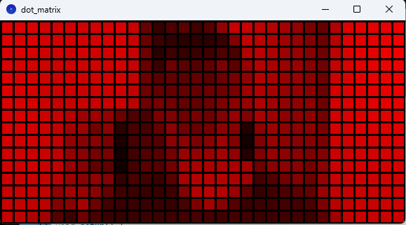

# processing-dot-matrix-cam
Simulate dot matrix looking effects. Stream inputs from a web camera. Currently only support single color but can have 255 level of brightness for each pixel.

To change the configurations:

- `dot_size`: the size of a single pixel
- `columns`: number of dots per line
- `rows`: number of horizontal lines of dots

Programmed with [Processing](https://processing.org/).

